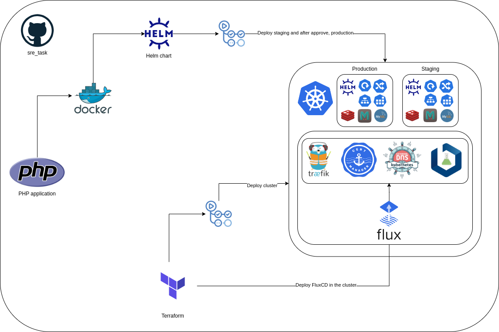

# Solution

## Architecture



## Steps

1- Upgrade predis/predis to the latest version
2- Install php-memcached packaged and enable it in php.ini
3- Set in `code/config/settings.php` dinamic values for Redis, MySQL and Memcached with environment variables
4- Execute database migrations in the application and grant permissions to the application user
5- Dockerize the application
6- Use docker-compose to run the application and its dependencies
7- Add a Makefile to simplify the execution of the application in local
8- Deploy a kubernetes cluster in Terraform
9- Deploy core apps in the cluster with FluxCD
10- Create secrets in each environment (Staging and production) with the values of the environment variables and encrypt them with sealed-secrets
11- Create a Helm chart for the application with the dependencies (redis, mysql and memcached) and a job prehook to execute the database migrations
12- Deploy the application in the cluster with Helm in two environments (Staging and Production)
13- In each Pull Request, run the tests, build the image and execute terraform plan with a Github Action workflow
14- Each time a Pull Request is merged, deploy the application in the cluster in the staging environment
15- When the staging environment is approved in a manual step(an issue is created), deploy the application in the production environment

## Summary

- Upgrade predis/predis to the latest version
- Install php-memcached packaged and enable it in php.ini
- Set in settings.php dinamic values for Redis, MySQL and Memcached with environment variables
- Execute database migrations in the application and grant permissions to the application user
- Dockerize the application
- Use docker-compose to run the application and its dependencies
- Add a Makefile to simplify the execution of the application in local
- Deploy a kubernetes cluster in Terraform
- Deploy core apps in the cluster with FluxCD
- Create secrets in each environment (Staging and production) with the values of the environment variables
- Deploy the application in the cluster with Helm in two environments (Staging and Production)
- Fix this issue in Kubernetes:

```
    "statusCode": 500,
        "error": {
            "type": "SERVER_ERROR",
            "description": "ERROR: stream_socket_client(): Unable to connect to tcp:\/\/redis:tcp:6379 (Operation timed out) on line 108 in file \/var\/www\/html\/vendor\/predis\/predis\/src\/Connection\/StreamConnection.php."
```

## Local Development

### Requirements

- Docker
- Make

### Usage

- Raise the application with the following command:

```bash
make dev
```

curl http://localhost:8080/charmander

```bash
❯ curl localhost:8080/charmander                                                                                                                             ─╯
{
    "statusCode": 200,
    "data": {
        "name": "charmander",
        "type": "fuego",
        "count": 1
    }
}%
```

- Check logs with the following command:

```bash
make dev-logs
```

- Stop the application with the following command:

```bash
make dev-stop
```

- Remove the application with the following command:

```bash
make dev-rm
```

## Improvements

- Add e2e tests with kind
- Replace the deployment of the application (FluxCD or Helmfile)
- Use semver for the versioning of the application
- Add observability to the application
- Add to the application a health check endpoint for readiness and liveness
- With Kyverno, validate the resources in the cluster and automate labeling
- Get SBOM for the application
- Add a terraform drift detection workflow
- Deploy the application in high availability (different zones)
- Add a canary deployment for the application
- Move MySQL to a managed service
- Use Redis with high availability
